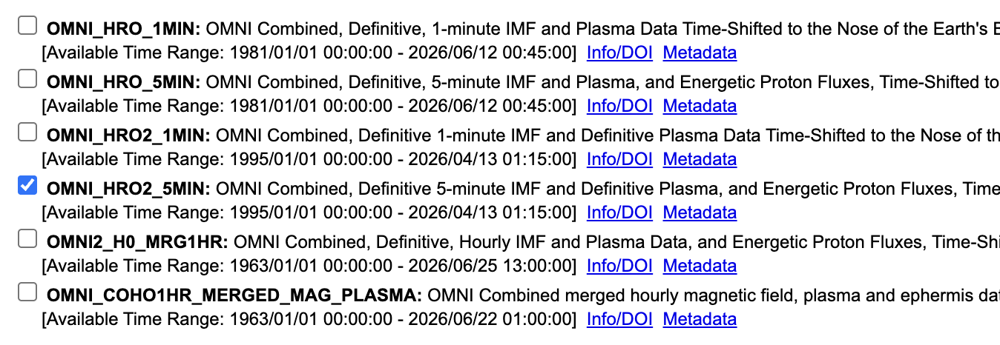
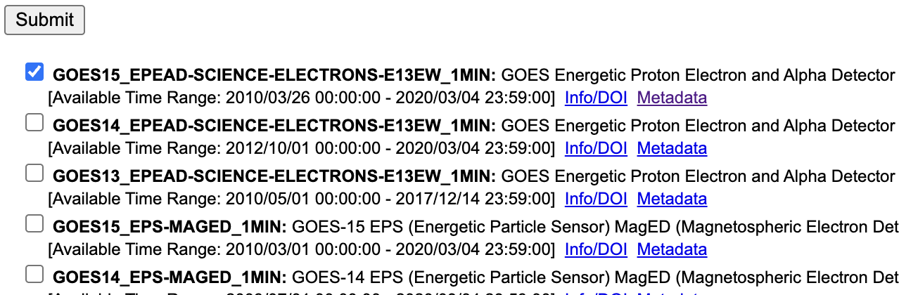
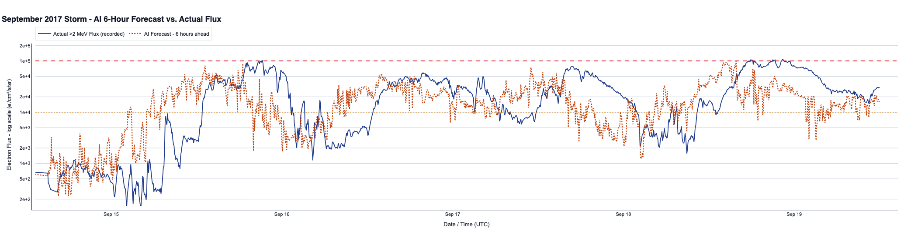

## The Core Problem Statement Visually Understanding

## The Dataset Sources

[cdaweb.gsfc.nasa.gov](https://cdaweb.gsfc.nasa.gov)

1. To **train** our AI, we need 11 years of history. We will manually download these as `.cdf` files from the NASA CDAWeb site.
2. To run our **live dashboard** during the demo, we will use free JSON APIs from NOAA to feed live data into our trained AI.

### **1. The Inputs / Features (X): The Solar Wind (OMNI)**
This is what our AI will look at to predict the future.

When it asks to pick variables, so we checked these boxes. This is the what our AI needs to learn:
1. `Bz (nT), GSM, determined from post-shift GSE components` (This is the trigger! Southward/Negative Bz opens the shield).
2. `Flow Speed (km/s), GSE` (How fast the storm is hitting).
3. `Proton density (n/cc)` (How thick/heavy the plasma cloud is).

4. `Bx (nT) GSM` and `By (nT) GSM` the other two components of IMF. By in particular affects the asymmetry of how energy enters the magnetosphere. Not as important as Bz but still useful.
5. `Flow Pressure (nPa)` — this is the dynamic pressure, calculated as density × speed². It measures the actual "punch" of the solar wind hitting the magnetosphere. Often pre-computed in OMNI so just check it directly.
6. `SYM-H index (nT)` — this is essentially the real-time Dst index at 1-minute resolution. It measures how disturbed Earth's magnetic field is. Goes strongly negative during storms. This is a powerful predictor because it directly reflects energy already stored in the ring current — which is tightly coupled to outer belt electron flux. This single feature can significantly boost your model.

### **2. The Target / Output (Y): The Killer Electrons (GOES)**
This is what our AI is trying to guess/predict.

• **Which exact variables to check (from your 8th screenshot):**
1. `A/W Detector: Electron integral flux E2 >2 MeV (background, contamination and dead time corrected)`
*(Why this one? "E2" stands for Energy level 2, which is >2 MeV. The "corrected" part means NASA already removed sensor glitches, saving you hours of data cleaning).*

2. `E1 >0.8 MeV flux` in addition to E2 >2 MeV - having the lower energy channel as an input feature (not just the target) helps the model because lower-energy electrons accelerate first and act as a precursor to the >2 MeV spike. So E1 becomes an input feature X and E2 remains your target Y.

## What this graph is showing

**The blue line (actual GOES-15 recorded flux):**

Starts around Sept 14-15 at low levels (~10²-10³), then rapidly rises through Sept 15, crosses the warning threshold (10⁴) around Sept 15 midday, climbs past the danger threshold (10⁵) around Sept 15-16, stays elevated above danger for nearly 2 full days, then gradually declines. This is textbook >2 MeV electron flux behavior after a geomagnetic storm — exactly what the real GOES-15 data shows for this event.

**The orange dotted line (AI 6-hour forecast):**

It's running slightly ahead of the blue line during the rise phase - meaning the model is predicting the flux increase before it actually happens. That is literally the entire purpose of this system. Then it tracks alongside the blue line through the sustained danger period. The two lines are in the same order of magnitude throughout. They move together.

**The red dashed danger line at 10⁵:** Both lines cross it. Both stay above it for extended periods. The danger event is clearly shown.

**This is real NASA GOES-15 data from September 2017.** Not synthetic. We’ve downloaded it from CDAWeb. This is the actual recording of the actual storm.